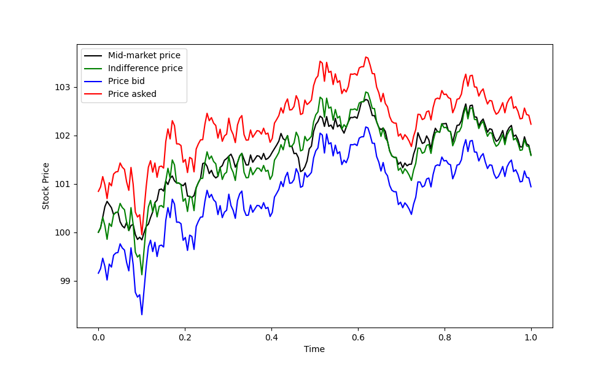
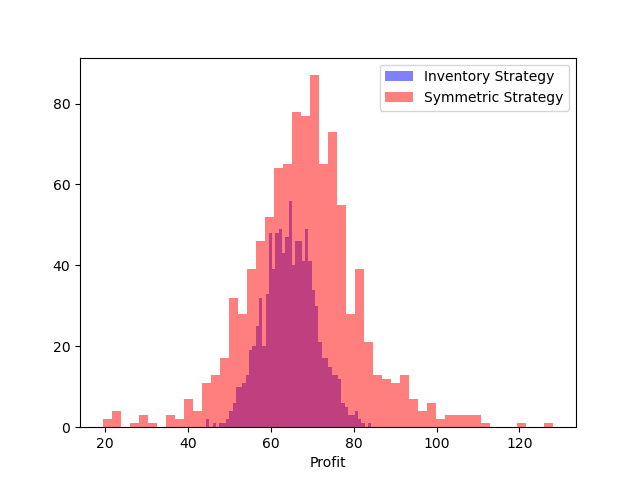
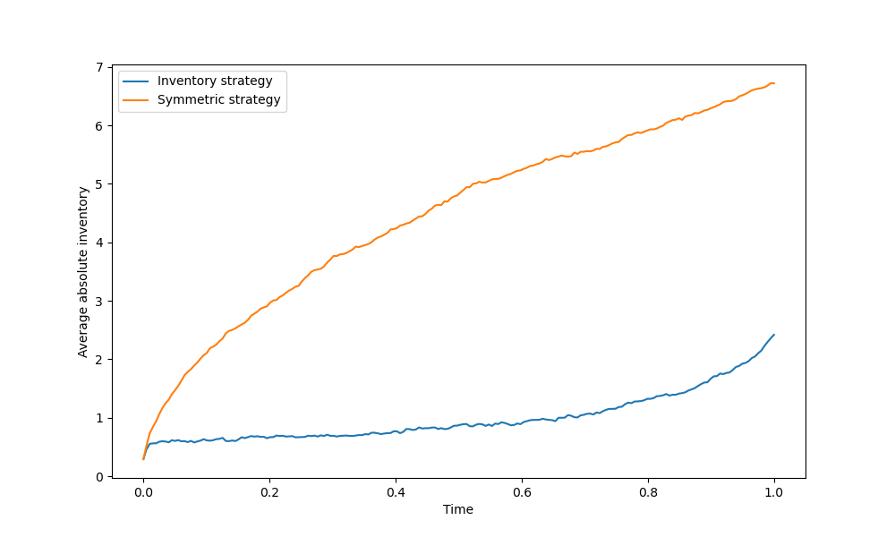

# Avellaneda-Stoikov Market-Making Model
Python implementation of the Avellaneda-Stoikov high-frequency market-making model, based on the 2006 working paper and 2008 Quantitative Finance publication. Derives optimal bid/ask quotes using inventory-adjusted reservation prices and exponential order arrival rates, with Monte Carlo simulation and comparison against a symmetric benchmark strategy.


## Features

The project includes:
- Replication of Table 1 from the paper (inventory vs symmetric strategy comparison)
- Figure 1: single path plot showing mid-price, indifference price, bid and ask quotes
- Figure 2: P&L histogram comparing both strategies
- Average absolute inventory path comparison
- Gamma sensitivity experiment (paper replication + stress test)
- Reproducible results via optional random seeding
- Input validation on all model parameters
- Basic pytest suite covering formulas, reproducibility and inventory-risk behaviour

## Model

**Reservation price:**
$$r(s, q, t) = s - q\gamma\sigma^2(T-t)$$

Where $s$ is the mid-price, $q$ is the current inventory, $\gamma$ is the risk aversion parameter, $\sigma^2$ is the variance of the mid-price, and $(T-t)$ is the time remaining.

**Optimal spread:**
$$\delta^a + \delta^b = \gamma\sigma^2(T-t) + \frac{2}{\gamma}\ln\left(1 + \frac{\gamma}{k}\right)$$

Where $k$ is the order arrival decay parameter. The first term penalises inventory risk; the second calibrates to market liquidity.

**Order arrival intensity:**
$$\lambda(\delta) = Ae^{-k\delta}$$

Where $\delta$ is the distance of the quote from the mid-price. The further the quote, the lower the probability of execution.

**Parameters:**

| Parameter | Description |
|-----------|-------------|
| $s$ | Mid-price |
| $q$ | Current inventory |
| $\gamma$ | Risk aversion coefficient |
| $\sigma$ | Mid-price volatility |
| $T-t$ | Time remaining until terminal horizon |
| $k$ | Order arrival decay rate |
| $A$ | Base order arrival intensity |

## Example Output

*Results below use `seed=42` for reproducibility.*

**Simulation results (1000 runs, γ=0.1):**

| Strategy | Profit | std(Profit) | Final q | std(Final q) |
|----------|--------|-------------|---------|--------------|
| Inventory | 64.57 | 6.38 | -0.10 | 3.04 |
| Symmetric | 67.90 | 13.27 | 0.17 | 8.39 |

**Figure 1: Single Simulation path**



**Figure 2: P&L distribution**



**Average absolute inventory over time**



## Gamma Sensitivity Experiment

*Results below use `seed=42` for reproducibility.*

**Paper replication (γ = 0.01, 0.1, 0.5):**

| γ | Strategy | Profit | std(Profit) | Final q | std(Final q) |
|---|----------|--------|-------------|---------|--------------|
| 0.01 | Inventory | 68.13 | 8.70 | 0.13 | 5.15 |
| 0.01 | Symmetric | 68.74 | 13.83 | 0.32 | 8.67 |
| 0.1 | Inventory | 64.57 | 6.38 | -0.10 | 3.04 |
| 0.1 | Symmetric | 67.90 | 13.27 | 0.17 | 8.39 |
| 0.5 | Inventory | 48.47 | 5.61 | -0.02 | 2.03 |
| 0.5 | Symmetric | 57.61 | 11.29 | 0.21 | 7.08 |

**Stress test (γ = 1, 5, 10):**

| γ | Strategy | Profit | std(Profit) | Final q | std(Final q) |
|---|----------|--------|-------------|---------|--------------|
| 1 | Inventory | 31.47 | 4.77 | 0.00 | 1.70 |
| 1 | Symmetric | 43.79 | 9.10 | 0.01 | 5.67 |
| 5 | Inventory | 5.96 | 1.75 | -0.01 | 1.13 |
| 5 | Symmetric | 11.25 | 4.17 | -0.21 | 3.02 |
| 10 | Inventory | 2.82 | 1.27 | -0.00 | 0.91 |
| 10 | Symmetric | 5.99 | 2.98 | -0.09 | 2.19 |

## File Structure

```text
avellaneda-stoikov/
│
├── agent.py
│   └── Computes reservation price and bid/ask spread for both strategies.
│
├── market.py
│   └── Computes the mid-price and discrete-time order arrival process.
│
├── simulator.py
│   └── Runs Monte Carlo simulations of a LOB market in order to compute required outputs for analysis.
│
├── experiments.py
│   └── Reruns the simulator for different plausible values of gamma, as well as stress tests.
│
├── plot.py
│   └── Visualisation of key results.
│
├── main.py
│   └── Example usage, model comparison and output plots.

├── tests/
│   └── test_model.py
│       └── Basic tests for formula correctness, reproducibility and strategy behaviour.
│
└── README.md
```

## Usage

**Run the main simulation:**
```bash
python main.py
```

**Run gamma sensitivity experiments:**
```bash
python experiments.py
```

**Key parameters (set in main.py):**

| Parameter | Default | Description |
|-----------|---------|-------------|
| `gamma` | 0.1 | Risk aversion coefficient |
| `sigma` | 2 | Mid-price volatility |
| `T` | 1 | Terminal horizon |
| `k` | 1.5 | Order arrival decay rate |
| `A` | 140 | Base order arrival intensity |
| `dt` | 0.005 | Time step |
| `n_simulations` | 1000 | Number of Monte Carlo runs |

**Run the test suite:**
```bash
python -m pytest -q
```

## Implementation Notes

- **Linear approximation of order arrival terms**: follows the paper's approach (equation 3.14), giving the closed-form spread in equation 3.18 rather than requiring numerical PDE solving
- **Discrete-time fill process**: order arrivals are simulated as Bernoulli draws at each time step, using `min(1, lambda * dt)` as a small time-step approximation to the continuous-time Poisson arrival process.
- **Common random numbers via seeding**: both strategies are evaluated on identical price paths and order arrival draws (when `seed` is passed), so the variance comparison reflects strategy differences alone rather than luck
- **Sequential inventory updates**: inventory and cash depend on the previous step's order arrivals, so the simulation loop is inherently step-by-step rather than fully vectorised

## Key Results

- The inventory strategy achieves significantly lower P&L variance (std ~6.4 vs ~13.3) than the symmetric strategy while sacrificing only modest profit (~64.6 vs ~67.9), confirming the paper's central result
- Average absolute inventory held by the inventory strategy stays consistently close to zero throughout the trading horizon, while the symmetric strategy accumulates position freely: demonstrating the inventory management mechanism in action
- As γ increases, the inventory strategy's variance advantage widens while both strategies earn less: at γ=10, the inventory strategy earns 2.82 (std 1.27) vs the symmetric strategy's 5.99 (std 2.98), showing extreme risk aversion reduces profitability but tightens inventory control dramatically

## Future Extensions

- Vectorisation of some loops to improve computational speed: since mid-market price updates are independent, they can be computed before the for loop.
- Coupled order arrivals: this can be implemented since it is unrealistic that both a bid and ask order are filled in the same timeframe. The paper however does compute bid and ask order arrivals as independent events, so the current model is more faithful to their interpretation.
- Terminal inventory liquidation penalty: since high inventory close to the horizon T is harder to liquidate, we could introduce a parameter like $$\alpha q_T^2$$ in order to better reflect the true wealth of the agent.


## Technologies

- Python 3
- NumPy
- Matplotlib
- pytest

## References

Avellaneda, M. & Stoikov, S. (2008). High-frequency trading in a limit order book. Quantitative Finance, 8(3), 217-224. Earlier working paper version, 2006.